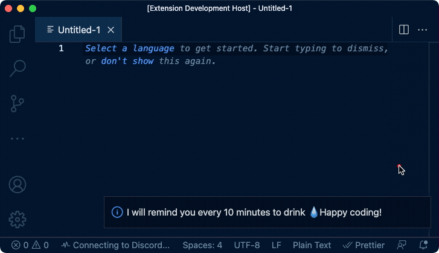

<a href="#" align="center"><h1>Hydra</h1></a>

In the coding madness ? It's important to stay hydrated to not break the flow 👩‍💻🔥
 Let vscode remind you to drink some water 💧

## Features

## 🤟🏻 Getting Started

- Install the extension via the vscode marketplace
- Change the reminder delay by opening the command pannel (cmd+p) & searching `hydra update delay`

## 📙 Requirements

- vscode
- Obvisouly : 💦

## 🚀 Upcoming features

- Allow the user to keep track of how much he drank
- Allow the user to change the reminder default value

## 💡 Inspiration

- [Twind](https://github.com/tw-in-js/twind) for their amazing README

## Issue/Feedback:

Log them in the [github issues](https://github.com/BenjaminRochez/vscode-hydra/issues) or hit me on [twitter](https://twitter.com/benjaminrochez).

## 🤝 Contributing

Feel free to make a PR

## ⚖️ License

The [MIT license](https://github.com/tw-in-js/twind/blob/main/LICENSE) governs your use of Hydra.
